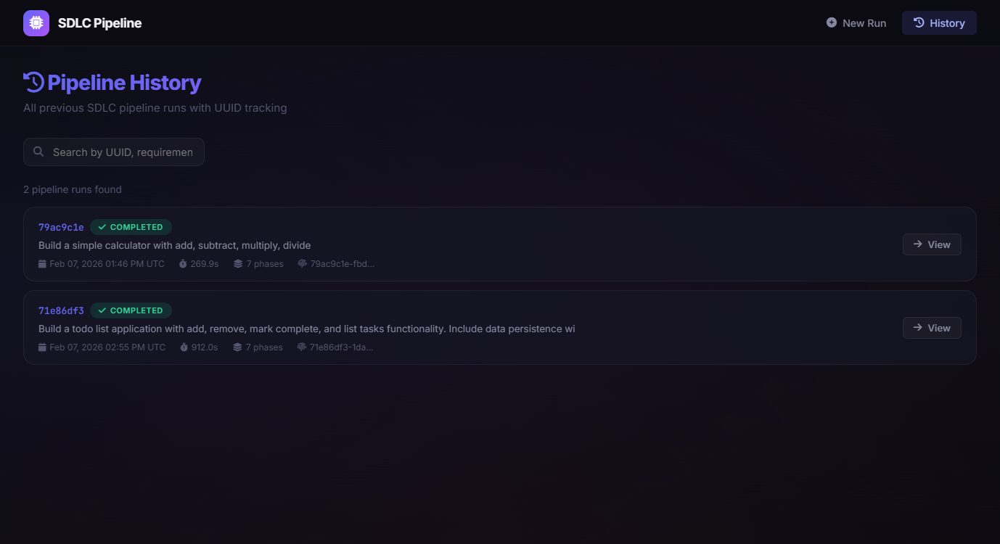
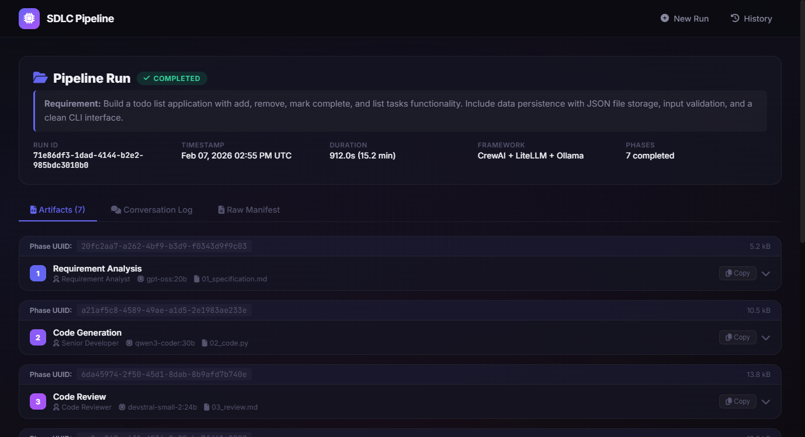

# 🚀 Ollama SDLC — CrewAI Multi-Agent Orchestration

<p align="center">
  <strong>7 AI Agents × 3 Local LLMs × 7 Pipeline Phases — 100% Offline on RTX 4090</strong>
</p>

<p align="center">
  <code>CrewAI</code> · <code>Ollama</code> · <code>Flask SSE</code> · <code>LiteLLM</code> · <code>Python 3.11+</code>
</p>

---

## 📋 Overview

**Ollama SDLC** is a fully local, AI-powered **Software Development Lifecycle** automation framework. Give it a natural-language requirement and **7 specialized AI agents** collaborate to produce a complete software project — specification, code, code review, tests, documentation, DevOps configs, and a Streamlit UI — all running on **3 local Ollama LLMs** with zero cloud dependencies.

```
📝 "Build a todo list app"
        ↓
   🤖 7 AI Agents collaborate
        ↓
   📦 Complete project output:
      ├── 01_specification.md
      ├── 02_code.py
      ├── 03_review.md
      ├── 04_tests.py
      ├── 05_documentation.md
      ├── 06_devops.md
      └── 07_ui_app.py
```

---

## ✨ Key Features

| Feature | Description |
|---------|-------------|
| 🔒 **100% Local** | No API keys, no cloud — runs entirely on your GPU via Ollama |
| 🤖 **7 Specialized Agents** | Each agent has a focused SDLC role, system prompt, and assigned model |
| 🧠 **3 Optimized LLMs** | `gpt-oss:20b`, `qwen3-coder:30b`, `devstral-small-2:24b` |
| 🔄 **Iterative Code Review** | Developer ↔ Reviewer loop (up to 3 rounds) until code is approved |
| 🆔 **UUID Traceability** | Every run and phase gets a UUID — full audit trail with manifests |
| 🌐 **Live Web Dashboard** | Flask + SSE real-time streaming of agent output |
| � **History & Replay** | Browse past runs, inspect artifacts, view conversation logs |

---

## 📸 Screenshots

### Dashboard — Launch New Pipeline


### Pipeline History


### Run Detail — 7 Phase Artifacts with UUID Tracking


> 📄 **Full Run Detail PDF:** [Run 71e86df3 — SDLC Dashboard.pdf](docs/Run%2071e86df3%20%E2%80%94%20SDLC%20Dashboard.pdf)

---

## 🧠 AI Agent Roster

| # | Agent | Role | Model | VRAM |
|---|-------|------|-------|------|
| 1 | **Requirement Analyst** | Transforms requirements into structured spec | `gpt-oss:20b` | 13 GB |
| 2 | **Senior Developer** | Generates production Python code | `qwen3-coder:30b` | 18 GB |
| 3 | **Code Reviewer** | Reviews code for bugs, security, PEP 8 | `devstral-small-2:24b` | 15 GB |
| 4 | **QA Engineer** | Creates comprehensive pytest test suite | `qwen3-coder:30b` | 18 GB |
| 5 | **Tech Writer** | Produces full documentation | `gpt-oss:20b` | 13 GB |
| 6 | **DevOps Agent** | Generates Dockerfile, CI/CD, configs | `gpt-oss:20b` | 13 GB |
| 7 | **UI Designer** | Creates Streamlit UI for the app | `gpt-oss:20b` | 13 GB |

---

## 🔄 Pipeline Flow

```
User Requirement
      │
      ▼
┌─────────────────┐
│ 1. Requirement   │ ─── Analyst → 01_specification.md
│    Analysis      │
└────────┬────────┘
         ▼
┌─────────────────┐
│ 2. Code          │ ─── Developer → 02_code.py
│    Generation    │
└────────┬────────┘
         ▼
┌─────────────────┐     ┌──────────────┐
│ 3. Code Review   │◄───►│  Revision    │  (up to 3 rounds)
│                  │     │  Loop        │
└────────┬────────┘     └──────────────┘
         ▼                    │
         ├── 03_review.md ◄───┘
         ▼
┌─────────────────┐
│ 4. Testing       │ ─── QA Engineer → 04_tests.py
└────────┬────────┘
         ▼
┌─────────────────┐
│ 5. Documentation │ ─── Tech Writer → 05_documentation.md
└────────┬────────┘
         ▼
┌─────────────────┐
│ 6. DevOps        │ ─── DevOps Agent → 06_devops.md
└────────┬────────┘
         ▼
┌─────────────────┐
│ 7. UI Design     │ ─── UI Designer → 07_ui_app.py
└─────────────────┘
```

---

## 📂 Project Structure

```
Ollama_SDLC_CrewAI_MultiAgent_Orchestration/
├── flask_app/                  # Flask Web Dashboard (main entry)
│   ├── app.py                  #   Flask server + SSE streaming
│   └── templates/              #   Jinja2 HTML templates
│       ├── base.html           #     Layout base
│       ├── index.html          #     Submit requirement form
│       ├── live.html           #     Real-time agent streaming
│       ├── history.html        #     Browse past runs
│       ├── detail.html         #     Inspect run artifacts
│       └── 404.html            #     Error page
│
├── crewai_sdlc/                # CrewAI Agent & Pipeline Engine
│   ├── __init__.py             #   Package init
│   ├── config.py               #   LLM instances & agent mappings
│   └── crew.py                 #   Agents, tasks & crew assembly
│
├── crewai_output/              # Generated pipeline outputs
│   └── <uuid>/                 #   Per-run folder
│       ├── 01_specification.md
│       ├── 02_code.py
│       ├── 03_review.md
│       ├── 04_tests.py
│       ├── 05_documentation.md
│       ├── 06_devops.md
│       ├── 07_ui_app.py
│       ├── manifest.json
│       └── conversation_log.json
│
├── requirements.txt            # Python dependencies
├── pyproject.toml              # PEP 621 project metadata
├── .env.example                # Environment variable template
├── .gitignore                  # Git ignore rules
├── LICENSE                     # MIT License
├── CONTRIBUTING.md             # Contribution guide
└── PROJECT_DOCUMENTATION.md    # Comprehensive project docs
```

---

## 🛠️ Prerequisites

- **Python 3.11+**
- **Ollama** installed and running (`ollama serve`)
- **NVIDIA GPU** with ≥ 24 GB VRAM (RTX 4090 recommended)
- Required Ollama models pulled:

```bash
ollama pull gpt-oss:20b
ollama pull qwen3-coder:30b
ollama pull devstral-small-2:24b
```

---

## ⚙️ Installation

```bash
# Clone the repository
git clone https://github.com/nareshvrde5220/Ollama_SDLC_CrewAI_MultiAgent_Orchestration.git
cd Ollama_SDLC_CrewAI_MultiAgent_Orchestration

# Create and activate virtual environment
python -m venv ollama_env
ollama_env\Scripts\activate        # Windows
# source ollama_env/bin/activate   # Linux / macOS

# Install dependencies
pip install -r requirements.txt
```

---

## ▶️ Usage

### Start the Dashboard

```bash
python flask_app/app.py
# Open http://localhost:5000 in your browser
```

### What You Can Do

- **Submit** a requirement via the web form (e.g. *"Build a REST API for a todo app"*)
- **Watch** 7 AI agents work in **real-time** via Server-Sent Events (SSE)
- **Browse** the **history** of all past pipeline runs
- **Inspect** individual run **artifacts** (spec, code, tests, docs, etc.)

---

## 📊 Output Artifacts

Each pipeline run generates 7 artifacts inside a UUID-named folder:

| File | Content |
|------|---------|
| `01_specification.md` | Structured requirements specification |
| `02_code.py` | Production Python implementation |
| `03_review.md` | Code review report with score & verdict |
| `04_tests.py` | pytest test suite |
| `05_documentation.md` | Full project documentation |
| `06_devops.md` | Dockerfile, docker-compose, CI/CD configs |
| `07_ui_app.py` | Streamlit UI application |

Plus `manifest.json` (run metadata) and `conversation_log.json` (full agent conversation history with UUIDs).

---

## 📈 Technical Specifications

| Spec | Value |
|------|-------|
| **GPU** | NVIDIA RTX 4090 (24 GB VRAM) |
| **Models** | 3 local Ollama LLMs (13–18 GB each) |
| **Max tokens** | 8,192 per agent call |
| **Temperature** | 0.2–0.3 (deterministic output) |
| **Review rounds** | Up to 3 iterations |
| **Request timeout** | 600s (10 min) per agent |
| **Web streaming** | Flask + Server-Sent Events |
| **Traceability** | UUID per run + per phase |

---

## 🗺️ Roadmap

- [ ] Multi-language support (JavaScript, Go, Rust)
- [ ] Parallel agent execution for independent phases
- [ ] Plugin system for custom agents
- [ ] Git integration for auto-committing artifacts
- [ ] Support for additional LLM backends (vLLM, llama.cpp server)
- [ ] Docker Compose for one-click deployment

---

## 📄 License

This project is licensed under the [MIT License](LICENSE).

---

<p align="center">
  Built with 🤖 <strong>CrewAI</strong> + 🦙 <strong>Ollama</strong> — 100% local, 100% private
</p>
